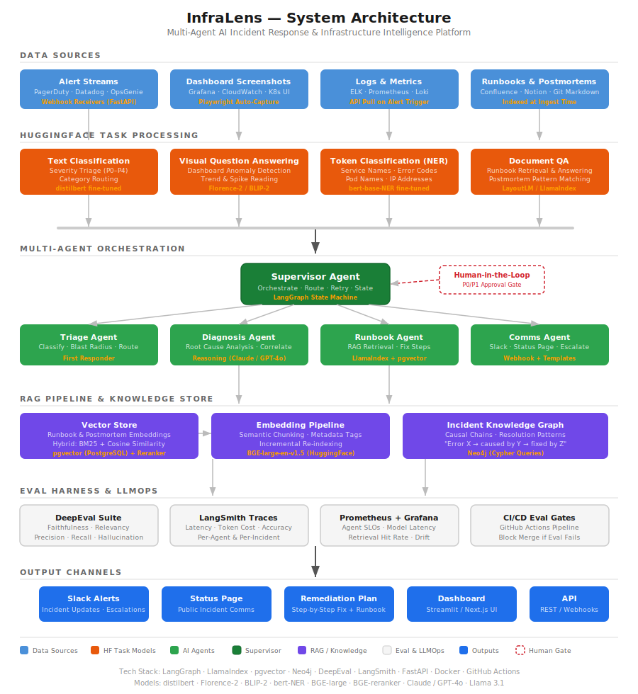

<div align="center">

# InfraLens

### AI-Powered Incident Response & Infrastructure Intelligence Platform

[](https://www.python.org/downloads/)
[](https://github.com/langchain-ai/langgraph)
[](https://huggingface.co/)
[](https://github.com/confident-ai/deepeval)
[](https://opensource.org/licenses/MIT)
[](https://docs.docker.com/compose/)

**InfraLens is a multi-agent AI system that automatically triages, diagnoses, and recommends fixes for infrastructure incidents in real time.** When an alert fires — a latency spike, a pod crash loop, a database connection exhaustion — InfraLens ingests the context, reads Grafana dashboards visually, extracts entities from logs, retrieves matching runbooks via RAG, performs root cause analysis, and drafts a remediation plan.

[Architecture](#architecture) · [Quick Start](#quick-start) · [Features](#features) · [Tech Stack](#tech-stack) · [Eval](#evaluation) · [Roadmap](#roadmap)

</div>

---

## The Problem

On-call engineers spend **30–60 minutes per incident** just gathering context — flipping between dashboards, searching Confluence for runbooks, scrolling through logs, and trying to correlate signals across systems. By the time they've identified the root cause, the impact has already compounded.

**InfraLens compresses that to under 2 minutes** by having AI agents do the context-gathering while the human makes the final call.

## Architecture

<p align="center">
  
</p>

The system is organized into **six layers**, each with clear responsibilities:

### Layer 1 — Data Sources
Webhook receivers ingest alerts from PagerDuty, Datadog, and OpsGenie. On each alert trigger, Playwright captures the relevant Grafana dashboard as a screenshot, the log aggregator API pulls recent error logs, and the runbook index is queried for matching documentation.

### Layer 2 — HuggingFace Task Processing
Each data type flows through a specialized HuggingFace model pipeline:

| Data Type | HF Task | Model | Output |
|---|---|---|---|
| Alert payload | Text Classification | `distilbert` (fine-tuned) | Severity (P0–P4) + category |
| Dashboard screenshot | Visual Question Answering | `Florence-2` / `BLIP-2` | Anomaly descriptions, trend readings |
| Error logs | Token Classification (NER) | `bert-base-NER` (fine-tuned) | Service names, error codes, pod IDs |
| Runbooks | Document QA | `LayoutLM` / `LlamaIndex` | Relevant remediation passages |

### Layer 3 — Multi-Agent Orchestration
Five agents coordinate through a **LangGraph state machine**:

```
                    ┌─────────────────────┐
                    │  Supervisor Agent    │
                    │  (Route · Retry ·    │
                    │   State Machine)     │
                    └────┬───┬───┬───┬─────┘
                         │   │   │   │
              ┌──────────┘   │   │   └──────────┐
              ▼              ▼   ▼              ▼
        ┌──────────┐  ┌──────────┐  ┌──────────┐  ┌──────────┐
        │  Triage   │  │Diagnosis │  │ Runbook  │  │  Comms   │
        │  Agent    │  │  Agent   │  │  Agent   │  │  Agent   │
        │           │  │          │  │          │  │          │
        │ Classify  │  │ Root     │  │ RAG      │  │ Slack    │
        │ Severity  │  │ Cause    │  │ Retrieve │  │ Status   │
        │ Route     │  │ Analysis │  │ Fix Steps│  │ Escalate │
        └──────────┘  └──────────┘  └──────────┘  └──────────┘
                                         │
                                    ┌────┴────┐
                                    │ Human   │
                                    │ Gate    │
                                    │ (P0/P1) │
                                    └─────────┘
```

- **Triage Agent** — Classifies alert severity, determines blast radius, routes to downstream agents
- **Diagnosis Agent** — Correlates signals across logs, metrics, and dashboard readings for root cause analysis
- **Runbook Agent** — RAG-powered retrieval over runbooks and past postmortems for matching remediation steps
- **Comms Agent** — Drafts Slack updates, status page messages, and escalation notifications
- **Supervisor Agent** — Orchestrates the workflow, handles retries, manages agent state transitions

**Human-in-the-loop:** P0/P1 incidents require human approval before remediation suggestions are dispatched.

### Layer 4 — RAG Pipeline & Knowledge Store
- **Vector Store** — pgvector (PostgreSQL) with hybrid BM25 + cosine similarity retrieval and cross-encoder reranking (`BGE-reranker-large`)
- **Embedding Pipeline** — `BGE-large-en-v1.5` with semantic chunking (not naive fixed-size) and metadata tagging
- **Knowledge Graph** — Neo4j stores incident causality chains: `Error X → caused by Y → fixed by Z`

### Layer 5 — Eval Harness & LLMOps
- **DeepEval** — Faithfulness, answer relevancy, contextual precision/recall on RAG outputs
- **LangSmith** — Full trace logging per agent per incident — latency, token usage, cost
- **Prometheus + Grafana** — Agent SLOs, model inference latency, retrieval hit rates, drift detection
- **CI/CD Eval Gates** — GitHub Actions pipeline that blocks merges if eval metrics degrade

### Layer 6 — Output Channels
Remediation plans, Slack alerts, status page updates, a Streamlit dashboard, and a REST API for integration.

---

## Features

- **Automatic alert triage** — Classifies incoming alerts by severity (P0–P4) and category (network, compute, storage, application) using a fine-tuned text classifier
- **Visual dashboard analysis** — Reads Grafana dashboard screenshots using VQA models to identify anomalies, spikes, and trend changes without requiring metric API access
- **Intelligent log parsing** — Extracts structured entities (service names, error codes, pod names, IPs) from raw logs using fine-tuned NER
- **RAG-powered runbook retrieval** — Searches 500+ runbooks and postmortems using hybrid vector + keyword search with reranking
- **Multi-agent root cause analysis** — Correlates signals from alerts, dashboards, logs, and runbooks through coordinated AI agents
- **Incident knowledge graph** — Learns from past incidents by storing causal relationships, improving diagnosis accuracy over time
- **Human-in-the-loop gates** — P0/P1 severity incidents require human approval before remediation actions
- **Production observability** — Full tracing, cost tracking, latency monitoring, and SLO dashboards
- **CI/CD eval pipeline** — Automated evaluation suite that blocks deployments if RAG faithfulness or agent accuracy degrades

---

## Tech Stack

| Layer | Technology | Purpose |
|---|---|---|
| **Agent Orchestration** | [LangGraph](https://github.com/langchain-ai/langgraph) | Stateful multi-agent workflows with supervisor pattern |
| **LLM Backbone** | Claude API / GPT-4o + open-source HF models | Frontier models for reasoning, open-source for classification |
| **RAG Framework** | [LlamaIndex](https://www.llamaindex.ai/) | Document parsing, hierarchical indexing, retrieval abstractions |
| **Vector Database** | [pgvector](https://github.com/pgvector/pgvector) (PostgreSQL) | Embedding storage with hybrid search |
| **Knowledge Graph** | [Neo4j](https://neo4j.com/) | Incident causality chains and resolution pattern storage |
| **Embeddings** | `BAAI/bge-large-en-v1.5` | Open-source embeddings via HuggingFace |
| **Reranking** | `BAAI/bge-reranker-large` | Cross-encoder reranking for retrieval precision |
| **Evaluation** | [DeepEval](https://github.com/confident-ai/deepeval) | RAG faithfulness, relevancy, precision, recall metrics |
| **Tracing** | [LangSmith](https://smith.langchain.com/) | Per-agent trace logging, latency, and cost analysis |
| **Monitoring** | Prometheus + Grafana | Agent SLOs, inference latency, retrieval hit rates |
| **API** | FastAPI | Webhook receivers, REST API, async processing |
| **Screenshot Capture** | Playwright | Automated Grafana dashboard screenshot pipeline |
| **Infrastructure** | Docker Compose | Multi-container local development environment |
| **CI/CD** | GitHub Actions | Eval gates, automated testing, model artifact versioning |
| **Frontend** | Streamlit | Incident dashboard and real-time monitoring UI |

---

## Quick Start

### Prerequisites

- Python 3.11+
- Docker & Docker Compose
- API keys: Anthropic or OpenAI (for LLM orchestration), HuggingFace (for model access)

### 1. Clone and configure

```bash
git clone https://github.com/yourusername/infralens.git
cd infralens
cp .env.example .env
```

Edit `.env` with your API keys:

```env
# LLM Provider (choose one or both)
ANTHROPIC_API_KEY=sk-ant-...
OPENAI_API_KEY=sk-...

# HuggingFace
HF_TOKEN=hf_...

# LangSmith (optional, for tracing)
LANGCHAIN_API_KEY=lsv2_...
LANGCHAIN_TRACING_V2=true
LANGCHAIN_PROJECT=infralens

# Slack (optional, for comms agent)
SLACK_WEBHOOK_URL=https://hooks.slack.com/services/...
```

### 2. Start infrastructure

```bash
docker compose up -d
```

This starts PostgreSQL (with pgvector), Neo4j, Prometheus, and Grafana.

### 3. Install dependencies

```bash
python -m venv .venv
source .venv/bin/activate
pip install -r requirements.txt
```

### 4. Index your runbooks

```bash
# Place runbook markdown files in data/runbooks/
python -m infralens.pipelines.index_runbooks --source data/runbooks/
```

### 5. Run the API server

```bash
uvicorn infralens.api.main:app --reload --port 8000
```

### 6. Simulate an incident

```bash
# Send a mock PagerDuty alert
python -m infralens.scripts.simulate_incident --type redis_connection_exhaustion
```

### 7. Run the eval suite

```bash
deepeval test run eval/test_rag_pipeline.py
deepeval test run eval/test_agent_accuracy.py
```

---

## Project Structure

```
infralens/
├── agents/                     # Multi-agent orchestration
│   ├── supervisor.py           # LangGraph supervisor agent
│   ├── triage.py               # Alert severity classification agent
│   ├── diagnosis.py            # Root cause analysis agent
│   ├── runbook.py              # RAG-powered runbook retrieval agent
│   ├── comms.py                # Slack/status page communication agent
│   └── state.py                # Shared agent state schema
│
├── pipelines/                  # Data processing pipelines
│   ├── alert_classifier.py     # Text classification (severity + category)
│   ├── dashboard_vqa.py        # Visual QA on Grafana screenshots
│   ├── log_ner.py              # Token classification for log entities
│   ├── document_qa.py          # Document QA over runbooks
│   ├── index_runbooks.py       # Runbook embedding + indexing pipeline
│   └── screenshot.py           # Playwright dashboard capture
│
├── rag/                        # RAG infrastructure
│   ├── embeddings.py           # BGE embedding pipeline
│   ├── chunking.py             # Semantic chunking strategies
│   ├── retriever.py            # Hybrid BM25 + vector retriever
│   ├── reranker.py             # Cross-encoder reranking
│   └── knowledge_graph.py      # Neo4j incident causality store
│
├── api/                        # FastAPI application
│   ├── main.py                 # App entrypoint + webhook routes
│   ├── routes/
│   │   ├── alerts.py           # Alert ingestion endpoints
│   │   ├── incidents.py        # Incident query + status endpoints
│   │   └── health.py           # Health check + readiness probes
│   └── models/                 # Pydantic request/response schemas
│
├── eval/                       # Evaluation suite
│   ├── test_rag_pipeline.py    # DeepEval RAG metrics
│   ├── test_agent_accuracy.py  # Agent decision accuracy tests
│   ├── test_triage.py          # Classification precision/recall
│   ├── datasets/               # Eval datasets (golden answers)
│   │   ├── rag_eval.json
│   │   ├── triage_eval.json
│   │   └── diagnosis_eval.json
│   └── conftest.py             # Shared eval fixtures
│
├── models/                     # Fine-tuned model training
│   ├── train_classifier.py     # Alert severity classifier training
│   ├── train_ner.py            # Log NER model training
│   └── data/                   # Training datasets
│
├── infra/                      # Infrastructure configs
│   ├── docker-compose.yml      # Full stack: Postgres, Neo4j, Prometheus, Grafana
│   ├── prometheus.yml          # Prometheus scrape config
│   ├── grafana/                # Grafana dashboard JSON exports
│   │   └── agent-slos.json
│   └── sql/
│       └── init.sql            # pgvector extension + schema setup
│
├── scripts/                    # Utility scripts
│   ├── simulate_incident.py    # Generate mock incidents for testing
│   ├── generate_eval_data.py   # Create eval datasets from real incidents
│   └── export_metrics.py       # Export LangSmith traces for analysis
│
├── data/                       # Sample data
│   ├── runbooks/               # Markdown runbook files
│   ├── postmortems/            # Past incident postmortems
│   ├── alerts/                 # Sample alert payloads (JSON)
│   ├── logs/                   # Sample log files
│   └── dashboards/             # Sample Grafana screenshot PNGs
│
├── docs/                       # Documentation
│   ├── architecture.svg        # System architecture diagram
│   ├── agent-flow.md           # Detailed agent interaction docs
│   └── eval-results.md         # Benchmark results and analysis
│
├── .github/
│   └── workflows/
│       ├── eval.yml            # CI eval gate — blocks merge on regression
│       └── test.yml            # Unit + integration test pipeline
│
├── .env.example                # Environment variable template
├── docker-compose.yml          # → infra/docker-compose.yml symlink
├── requirements.txt            # Python dependencies
├── pyproject.toml              # Project metadata + tool configs
└── README.md                   # You are here
```

---

## Evaluation

InfraLens includes a comprehensive eval harness that runs both locally and in CI/CD.

### RAG Pipeline Metrics

| Metric | Target | Description |
|---|---|---|
| Faithfulness | > 0.90 | Does the output match the retrieved context? |
| Answer Relevancy | > 0.85 | Is the response relevant to the incident query? |
| Contextual Precision | > 0.80 | Are relevant documents ranked higher? |
| Contextual Recall | > 0.80 | Are all relevant documents retrieved? |

### Agent Accuracy Metrics

| Metric | Target | Description |
|---|---|---|
| Triage Accuracy | > 0.93 | Correct severity classification (P0–P4) |
| Diagnosis Precision | > 0.80 | Root cause correctly identified |
| Runbook Match Rate | > 0.85 | Correct runbook retrieved for incident type |
| Task Completion | > 0.99 | Agent pipeline completes without errors |

### Running evaluations

```bash
# Full eval suite
deepeval test run eval/ --verbose

# Individual test files
deepeval test run eval/test_rag_pipeline.py
deepeval test run eval/test_agent_accuracy.py
deepeval test run eval/test_triage.py

# Generate eval report
deepeval test run eval/ --output eval-report.json
```

### CI/CD eval gates

The GitHub Actions workflow (`.github/workflows/eval.yml`) runs the full eval suite on every PR. If any metric drops below its target threshold, the merge is blocked.

---

## Observability

### LangSmith Tracing

Every agent interaction is traced in LangSmith with:
- Input/output for each agent step
- Token usage and estimated cost
- Latency per step and end-to-end
- Error traces and retry logs

### Grafana Dashboards

Import the pre-built dashboards from `infra/grafana/`:

- **Agent SLOs** — Task completion rate, median latency, P95 latency per agent
- **RAG Performance** — Retrieval hit rate, reranker effectiveness, embedding latency
- **Cost Tracker** — Token usage per model, cost per incident, daily/weekly trends
- **System Health** — API request rate, error rate, queue depth

### Prometheus Metrics

Custom metrics exposed at `/metrics`:

```
infralens_incidents_total{severity="P0"} 42
infralens_agent_latency_seconds{agent="diagnosis"} 1.23
infralens_rag_retrieval_hit_rate 0.91
infralens_llm_tokens_total{model="claude-sonnet"} 150000
infralens_llm_cost_usd_total 12.50
```

---

## Configuration

### Model Routing

InfraLens uses intelligent model routing to balance cost and quality:

```python
# config/models.py
MODEL_ROUTING = {
    "triage": "haiku",           # Fast, cheap — classification only
    "diagnosis": "sonnet",       # Complex reasoning — needs quality
    "runbook_retrieval": "local", # BGE embeddings — no API cost
    "comms_draft": "sonnet",     # Needs good writing quality
    "supervisor": "sonnet",      # Orchestration decisions
}
```

### Alert Sources

Configure which alert sources to listen to in `config/sources.yml`:

```yaml
sources:
  pagerduty:
    enabled: true
    webhook_path: /webhooks/pagerduty
    auth_token: ${PAGERDUTY_TOKEN}
  datadog:
    enabled: true
    webhook_path: /webhooks/datadog
    api_key: ${DATADOG_API_KEY}
  opsgenie:
    enabled: false
```

---

## Roadmap

- [x] **Phase 1** — Alert ingestion, text classification, basic RAG retrieval
- [ ] **Phase 2** — Visual QA for dashboards, NER for logs, hybrid search + reranking
- [ ] **Phase 3** — LangGraph multi-agent orchestration, human-in-the-loop gates
- [ ] **Phase 4** — DeepEval suite, LangSmith tracing, CI/CD eval gates, knowledge graph
- [ ] **Stretch** — Kubernetes deployment, auto-remediation execution, multi-tenant support

---

## Contributing

Contributions are welcome. Please read the [contributing guidelines](docs/CONTRIBUTING.md) before submitting a PR.

1. Fork the repo
2. Create a feature branch (`git checkout -b feature/amazing-feature`)
3. Run the eval suite (`deepeval test run eval/`)
4. Commit your changes (`git commit -m 'Add amazing feature'`)
5. Push to the branch (`git push origin feature/amazing-feature`)
6. Open a Pull Request

All PRs must pass the eval gate in CI before merge.

---

## License

This project is licensed under the MIT License — see the [LICENSE](LICENSE) file for details.

---

<div align="center">

**Built with** [LangGraph](https://github.com/langchain-ai/langgraph) · [LlamaIndex](https://www.llamaindex.ai/) · [HuggingFace](https://huggingface.co/) · [DeepEval](https://github.com/confident-ai/deepeval) · [pgvector](https://github.com/pgvector/pgvector) · [Neo4j](https://neo4j.com/)

</div>
